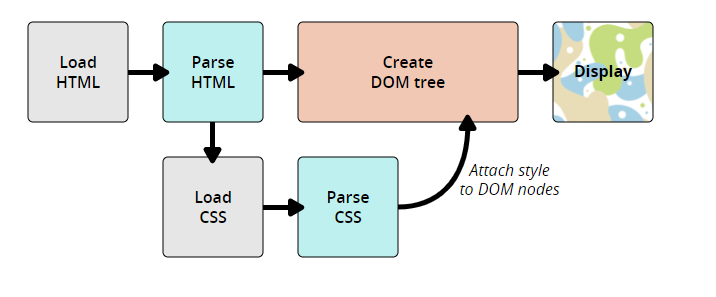

## CSS简介
```css
h1 {
    color: red;
    font-size: 5em;
}
```
- 选择器+ { } + 属性(property)：值(value)

入门案例：[css-test](../css-example/css-test/style.css)


### 内部样式表

内部样式表是指不使用外部CSS文件，而是将CSS放在HTML文件`<head>`标签里的`<style>`标签之中。

```html
<!DOCTYPE html>
<html>
  <head>
    <meta charset="utf-8">
    <title>My CSS experiment</title>
    <style>
      h1 {
        color: blue;
        background-color: yellow;
        border: 1px solid black;
      }

      p {
        color: red;
      }
    </style>
  </head>
  <body>
    <h1>Hello World!</h1>
    <p>This is my first CSS example</p>
  </body>
</html>
```
### 内联样式表

内联样式表存在于HTML元素的style属性之中。其特点是每个CSS表只影响一个元素：

```html
<!DOCTYPE html>
<html>
  <head>
    <meta charset="utf-8">
    <title>My CSS experiment</title>
  </head>
  <body>
    <h1 style="color: blue;background-color: yellow;border: 1px solid black;">Hello World!</h1>
    <p style="color:red;">This is my first CSS example</p>
  </body>
</html>
```
- **注意：除非你有充足的理由，否则不要这样做！它难以维护**

## CSS是如何工作的



- 浏览器载入HTML文件（比如从网络上获取）。
- 将HTML文件转化成一个DOM（Document Object Model），DOM是文件在计算机内存中的表现形式
- 浏览器会拉取该HTML相关的大部分资源，比如嵌入到页面的图片、视频和CSS样式。JavaScript则会稍后进行处理，
- 浏览器拉取到CSS之后会进行解析，根据选择器的不同类型（比如element、class、id等等）把他们分到不同的“桶”中。浏览器基于它找到的不同的选择器，将不同的规则（基于选择器的规则，如元素选择器、类选择器、id选择器等）应用在对应的DOM的节点中，并添加节点依赖的样式（这个中间步骤称为渲染树）。
- 上述的规则应用于渲染树之后，渲染树会依照应该出现的结构进行布局。
- 网页展示在屏幕上（这一步被称为着色）


### DOM
一个DOM有一个树形结构，标记语言中的每一个元素、属性以及每一段文字都对应着结构树中的一个节点

for example:
```html
<p>
  Let's use:
  <span>Cascading</span>
  <span>Style</span>
  <span>Sheets</span>
</p>
```
生成的DOM树形结构：
```
P
├─ "Let's use:"
├─ SPAN
|  └─ "Cascading"
├─ SPAN
|  └─ "Style"
└─ SPAN
   └─ "Sheets"
```


## 层叠与继承
层叠
- Stylesheets cascade(样式表层叠)： css规则的顺序很重要；当应用两条同级别的规则到一个元素的时候，**写在后面的就是实际使用的规则**。

优先级
- 一个元素选择器不是很具体 — 会选择页面上该类型的所有元素 — 所以它的分数就会低一些。
- 一个类选择器稍微具体点 — 它会选择该页面中有特定 class 属性值的元素 — 所以它的分数就要高一点。

for example:
```
.main-heading { 
    color: red; 
}
        
h1 { 
    color: blue; 
}

<h1 class="main-heading">This is my heading.</h1>
```

继承：
- 一些设置在父元素上的css属性是可以被子元素继承的，比如color 和font-family，有些则不能，比如width，margins, padding, 和 borders 不会被继承
```css
body {
    color: blue;
}
/**/
span {
    color: black;
}
```
控制继承（CSS为控制继承提供了4个特殊的通用属性值）每个css属性都接收这些值：
- inherit：设置该属性会使子元素属性和父元素相同
- initial：设置属性值和浏览器默认样式相同
- unset：将属性重置为自然值，也就是如果属性是自然继承那么就是 inherit
- all: all属性可以重设所有属性值


一般情况下是：优先级 > 资源顺序


## 选择器

- 元素选择器
```css
h1 {} 
```
- 类选择器
```css
.box{}
```
- ID选择器
```css
#one {
    background-color: yellow;
}
h1#heading {
    color: rebeccapurple;
}
```
- 属性选择器
```css
a[title] { }
```
- 伪类选择器
```css
/*文章段落的第一段*/
article p:first-child {
    font-size: 120%;
    font-weight: bold;
}
/*鼠标悬停*/   
a:hover {
    color:hotpink;
}
```
- 伪元素选择器
```css
/*选择第一行*/
article p::first-line {
    font-size: 120%;
    font-weight: bold;
}     
```
- 组合伪类和伪元素
```css
article p:first-child::first-line { 
  font-size: 120%; 
  font-weight: bold; 
}
```
- 后代选择器
```css
.box p {
    color: red;
}  
```
- 子选择器
```css
.box p {
    color: red;
}  
```

## 盒模型

完整的 CSS 盒模型应用于块级盒子，内联盒子只使用盒模型中定义的部分内容。模型定义了盒的每个部分 —— margin, border, padding, and content —— 合在一起就可以创建我们在页面上看到的内容

CSS中组成一个块级盒子需要:

- **Content box**: 这个区域是用来显示内容，大小可以通过设置 width 和 height.
- **Padding box**: 包围在内容区域外部的空白区域； 大小通过 padding 相关属性设置。
- **Border box**: 边框盒包裹内容和内边距。大小通过 border 相关属性设置。
- **Margin box**: 这是最外面的区域，是盒子和其他元素之间的空白区域。大小通过 margin 相关属性设置


在标准模型中，如果你给盒设置 width 和 height，实际设置的是 content box。 padding 和 border 再加上设置的宽高一起决定整个盒子的大小
```css
.box {
  width: 350px;
  height: 150px;
  margin: 25px;
  padding: 25px;
  border: 5px solid black;
}
```